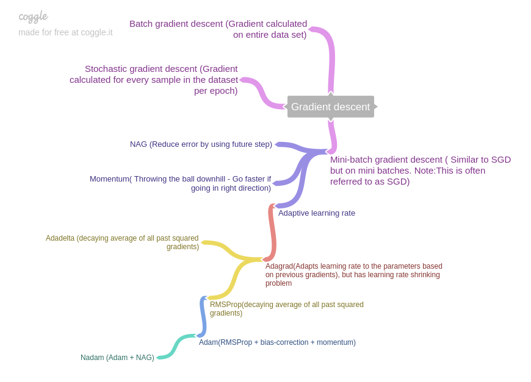

## 面试A&Q

> **零散问题**
>
> epoch和batch的设置意义
>
> 如何调整learning rate
>
> 孪生网络
>
> 分词，POS 
>
> > **激活函数的问题**
> >
> > > 1. 非零中心的激活函数会导致参数更新变慢吗？
> > >
> > >    https://liam.page/2018/04/17/zero-centered-active-function
> > >
> > >    在对某一层参数做更新的时候
> > >    $$
> > >    f(\vec{x};\vec{w}) = f(Z)=f(\sum x_iw_i)
> > >    \\
> > >    \frac{\partial L}{\partial w_i} = \frac{\partial L}{\partial f}\frac{\partial f}{\partial Z}\frac{\partial Z}{\partial w_i}
> > >    \\
> > >    $$
> > >    
> >
> > 
> >
> > 
>
> > **Gradient Clipping/ Gradient Norm**
> >
> > https://towardsdatascience.com/what-is-gradient-clipping-b8e815cdfb48
> >
> > 为了解决梯度下降和梯度爆炸的问题。clip就是限制gradient在一定区间内。norm就是把gradient向量的大小rescale到一个固定范围。
> >
> > 目标函数的landscope过于陡峭，在local minima附近l有一个巨大的函数值变化加上较小的自变量变化会导致梯度变得很大，导致一不留神步子就跨大了。
>
> **贝叶斯网络**
>
> > **统计语言模型**
> >
> > 就是计算token序列组合的全概率$P(W)=P(w_{1:T})=P(w_1,w_2,...,w_T)$
> >
> > 通过贝叶斯公式还可以进一步代换：$P(w_{1:T}) = p(w_1)p(w2|w1)p(w_3|w_{1:2})...p(w_T|w_{1:T-1})$这样只要计算$p(w_1)$和$p(w_k|w_{1:k-1}), k\in\{2,3,...,T\}$这些个概率就好了。
>
> > **N-gram 语言模型**
> >
> > $p(w_{1:i}) = p(w_{1:i-1})p(w_i|w_{1:i-1})$ 可以得到 $p(w_i|w_{1:i-1}) = \frac{p(w_{1:i})}{p(w_{1:i-1})}$, 利用大数定理，海量的文本可以用频率进行代换 $p(w_i|w_{1:i-1}) = \frac{N(w_{1:i})}{N(w_{1:i-1})}$ 当序列很长即i很大的时候，统计的开销就比较大。n-gram就应引入了一个n-1阶的马尔可夫假设，
> >
> > $p(w_i|w_{1:i-1}) \approx p(w_i|w_{i-n+1:i-1}) \approx \frac{N(w_{i-n+1:i})}{N(w_{i-n+1:i-1})}$
>
> > **word2vec**
> >
> > > **CBOW**
> > >
> > > 前后history/future词汇过dense得到向量再avg作为current的表示，在做softmax，预测label概率
> > >
> > > **hierachical softmax**
> > >
> > > https://zhuanlan.zhihu.com/p/56139075
> > >
> > > 如果最后预测词的时候，词表很大，softmax的计算开销就很大。所以引入hierachical softmax，用huffman tree对词表按词频进行编码（向左0，向右1），每个叶子结点代表一个词。从softmax是在一个flaten的维度上计算（｜V｜）变为，在二叉树上的路径上进行二分（log｜V｜）。
> > >
> > > **negative sampling**
> > >
> > > 如果对整个词表｜V｜做分类，其中有｜V-1｜token都是负例，计算太大，可以优化为每次做softmax分类的时候随机词采样一些词表中的词作负例，把｜V｜降到｜K｜个。
> > >
> > > **Skip-gram**
> > >
> > > 中心词预测context词（history/future）概率。
>
> > **Glove**
> >
> > http://menc.farbox.com/machine-learning/2017-04-11

> **Focal Loss**
>
> Focal Loss for Dense Object Detection

> **CNN/ResNet/Inception**

> **BatchNormalization/LayerNormalization**
> Batch Normalization: Accelerating Deep Network Training by Reducing Internal Covariate Shift
>
> Layer Normalization
>
> > $$
> > \gamma \cdot \frac{x-u}{\sigma+\epsilon} + \beta
> > \\ u = mean(x, axis=-1,keepdim=True)
> > \\ \sigma = std(x, axis=-1, keepdim=True, unbiased=False)
> > $$
> >
> > 

> **Overfitting&Underfitting**
>
> >  **Dropout**
> >
> >  Dropout: A Simple Way to Prevent Neural Networks from Overfitting
>
> > **Early Stopping**
>
> > **weight penalties(L1/L2)**
>
> > **Soft Weight Sharing**
> >
> > Simplifying neural networks by soft weight-sharing
>
> >  **Gradient Vanishing & Exploding**
> >
> >  https://www.zhihu.com/question/34878706
> >
> >  On the difficulty of training Recurrent Neural Networks
> >
> >  Understanding the exploding gradient problem
> >
> >  **gradient-norm/gradient-clipping**
>
> >  **Generalization**

> **Activations**
>
> > ReLU/Softmax/LeakyReLU/PReLU/ELU/ThresholdedReLU

> **Metrics & Loss**
>
> > Probabilistic losses
> >
> > >  binary crossentropy/categorical crossentropy/sparse categorical crossentropy/poisson/kl divergence
> >
> > Regression losses
> >
> > > MSE/MAE/MAPE/MSLE/cosine similarity/huber/logCosh
> >
> > Hinge losses
> >
> > > Hinge/Squared Hinge/CategoricalHinge

> **Optimizers**
>
> https://towardsdatascience.com/10-gradient-descent-optimisation-algorithms-86989510b5e9
>
> https://remykarem.github.io/blog/gradient-descent-optimisers.html
>
> > SGD/RMSprop/Adam/Adadelta/Adagrad/Adamax/Nadam/Ftrl

> **Initializers**
>
> > RandomNormal/RandomUniform/TruncatedNormal/Zeros/Ones/GlorotNormal/GlorotUniform/Identity/Orthogonal/Constant/VarianceScaling/Custom

> **Regularizers**
>
> > L1/L2/l1_l2/Custom
> >
> > **weight-decay**

> **RNN/LSTM/GRU**
>
> [RNN/LSTM/GRU animation](https://towardsdatascience.com/animated-rnn-lstm-and-gru-ef124d06cf45)
>
> On the difficulty of training Recurrent Neural Networks
>
> **RNN**
> $$
> \left[ 
> \begin{matrix}
> h_t        \\
> y_t        \\
> \end{matrix}
> \right]
> = 
> \left[ 
> \begin{matrix}
> \sigma        \\
> \sigma         \\
> \end{matrix}
> \right]
> \left[ 
> \begin{matrix}
> \bold U        \\
> \sigma         \\
> \end{matrix}
> \right]
> \cdot[h_{t-1},x_t]
> $$
> 
>
> **LSTM**
> $$
> \left[ 
> \begin{matrix}
> i_t        \\
> f_t        \\
> o_t        \\
> \hat{c_t}  \\
> \end{matrix}
> \right]
> = 
> \left[ 
> \begin{matrix}
> \sigma        \\
> \sigma         \\
> \sigma         \\
> tanh  \\
> \end{matrix}
> \right]
> W\cdot[h_{t-1},x_t]
> \\
> c_t = f_t\odot c_{t-1}+i_t\odot\hat{c_t}
> \\
> h_t = o_t \odot tanh(c_t)
> $$
> **GRU**
> $$
> \left[ 
> \begin{matrix}
> r_t        \\
> z_t        \\
> \end{matrix}
> \right]
> = 
> \left[ 
> \begin{matrix}
> \sigma        \\
> \sigma         \\
> \end{matrix}
> \right]
> W\cdot[h_{t-1},x_t]
> \\
> h_{t-1}^{'} = h_{t-1} \odot r_t
> \\
> h^{'} = tanh(W\cdot[h_{t-1}^{'},x_t])
> \\
> h_t = (1-z_t) \odot h_{t-1} + z_t \odot h^{'}
> $$
> 通过一个门z控制调节信息$h_{t-1}$的保留和遗忘

> **Gradient Exploding & Vanishing**
>
> 梯度爆炸通常是由于不合理的参数初始化过大，导致梯度过大，梯度下降的过程中模型训练不稳定。梯度消失主要是由于模型深度加深，BP过程中浅层网络中的梯度由于激活函数的作用导致梯度过小，导致浅层网络中的参数难以更新。

> **Model Distilling & Compression**
>
> Distilling the Knowledge in a Neural Network

> **Few Shot & Zero Shot**

> **CRF/MC/HMM**
>
> http://www.cs.columbia.edu/~mcollins/crf.pdf
>
> **MRF**
>
> > **Markov Random Field** undirected graphical model.
> >
> > 性质：
> >
> > 1. $G=(V,E)$ V顶点代表随机变量 ，E边代表随机变量间的依赖关系
> > 2. 大图可以分级为子图（clique/factors）集合。如果用一个分解函数$\phi_j$表示子图$D_j$。对于每一种子图而言$\phi_j(d_j)$都要严格为正。
> > 3. 子图中的节点是俩俩联通。子图的集合等于所有节点的集合。
> > 4. 对于如下MRF $V=(A,B,C,D)$ , 联合概率可以写成： $Pr(A=a,B=b,C=c,D=d)=\frac{\phi_1(a,b)\phi_2(b,c)\phi_3(c,d)\phi_4(d,a)}{\sum_{a'}\sum_{b'}\sum_{c'}\sum_{d'}\phi_1(a',b')\phi_2(b',c')\phi_3(c',d')\phi_4(d',a')}$
> >
> > $$ \begin{matrix} A&—&D\\ |&&|\\ B&—&C\\ \end{matrix} $$ 
>
> 
>
> > **misc**
> >
> > Gibbs Distribution 
> >
> > $\beta(d_j)=log(\phi(d_j))$
> >
> > Energy: $E(x)=-\sum_{j=1}^J\beta_j(d_j),\ d_j\subseteq X$
> >
> > Gibbs:  $P(x)=\frac{e^{-E(x)}}{Z}, where\ Z=\sum_{x'\subseteq X}e^{-E(x')}$
>
> 

> **Topic Model/Latent Dirichlet Allocation **

> **Decision Tree/Random  Forest/Gradient Boosting Tree/LGBM/XGBoost/CatBoost**

> **BERT**
>
> BERT: Pre-training of Deep Bidirectional Transformers for Language Understanding
>
> > 1. 为什么BERT在第一句前会加一个[CLS]标志？（[unusedXX],[SEP],[UNK],[MASK]）
> >
> >    > [CLS], [SEP], [MASK]这些特殊的占位符的设计主要还是依从任务设计而设置的。在原语料中引入这些占位符可以很方便设计目标函数。比如[CLS] token所对应的模型输出可以用于pretaining阶段的NSP任务也可用于finetune阶段的分类任务。[MASK]token是在MLM任务中用于预测target token id。[CLS]作为一个设定的占位符，经过各层attention layer的计算后，压缩了整个句子的语义信息，所以可以作为一个比较方便的分类特征使用。[CLS] token attend到了后面的每一个token，学到了语义表示。[SEP] token用于区分上下句。
> >
> > 2. BERT的三个Embedding直接相加会对语义有影响吗？
> >
> >    > 从实验角度来看token-type id对应的embedding对最后的总的embedding向量表示影响不大。positional embedding是为了把位置信息融入的输入中，应为self-attention是无法分辨token序列的顺序。
> >
> > 3. 在BERT中，token分3种情况做mask，分别的作用是什么？
> >
> >    > 构造MLM任务的训练数据是会mask掉一个句子中15%的token。替换策略是1. 80%的几率替换成[MASK]token用于训练语言模型；2. 10%几率替换成随机的token；3. 10%为原token
> >
> > 4. 为什么BERT选择mask掉15%比例的词，可以是其他比例吗？
> >
> > 5. 针对句子语义相似度/多标签分类/机器翻译/文本生成的任务，利用BERT结构怎么做finetuning？
> >
> >    > 下游任务的设计，魔改模型的任务输出。1. 句子相似度可以将待比较的句子A和B用[SEP]拼接起来一起送入BERT。可以用最后层的[CLS] token作为分类特征过一层sigmoid激活函数的Dense Layer。分类标签就是0/1是否相似。binary crossentropy作为损失函数，finetune整个BERT和分类层的权重。2. 文本直接送入BERT，可以用最后层的[CLS] token作为分类特征过一层softmax激活函数的Dense Layer。categorical crossentropy作为损失函数，finetune整个BERT和分类层的权重。（有关分类特征的获取还可以从多个角度入手，可以用最后的[CLS]作为分类特征，可以对最后一层的输出进行max/avg等操作，可以获取倒数多层的输出进行max/avg等操作并进行concate。或者将上述的特征统统进行拼接，用作分类特征。）3. 机器翻译任务：**TODO**   4. 文本生成任务： **TODO** 
> >
> > 6. BERT非线性的来源在哪里？multihead-attention是线性的吗？
> >
> > 7. BERT的输入是什么，哪些是必须的，为什么position-id不用给，type-id和attention-mask没有给定的时候，默认是什么样？
> >
> >    > 输入input_ids(必须), input_mask(1填充), token_type_ids(0填充) , attention-mask: Tensor of shape [batch_size, from_seq_length, to_seq_length]
> >
> > 8. BERT是如何区分一词多义的？
> >
> >    > 在构建MLM训练目标时，[MASK]经过BERT的encoding层，得到$H_{\theta}(\hat{x})_t$表示。目标是似然函数$P(\bar{X}|\hat{X})$，在做极大似然估计的时候，建模目标强制性的将[MASK]的encoder输出向量向原token毕竟。从而让$H_{\theta}(\hat{x})_t$在不同的context下有了丰富的表示。可以表示多个词。
> >
> > 9. BERT训练时使用的学习率warm-up策略是怎么样的？为什么要这么做？
> >
> > 10. BERT采用哪种Normalization结构，LayerNorm和BatchNorm的区别，LayerNorm结构有参数吗，参数的作用是什么？
> >
> >     > Bert采用LayerNorm。LayerNorm和BatchNorm计算的时候求的维度不一样，B求0，L求-1。LayerNorm有两个参数，$\gamma(\frac{x-u}{\sigma})+\beta$ , enable$\gamma,\beta$可以控制不同维度特征的缩放和平移。
> >
> > 11. 为什么说ELMO是伪双向，BERT是真双向？产生这种差异的原因是什么？
> >
> >     > ELMo的语言模型LTR-LSTM和RTL-LSTM是同时独立训练的，将拼接得到的特征用于下游任务。BERT的Transformer结构每个token之间都彼此计算过attention，所以说是真双向语言模型。ELMo还是属于AR方式建模似然函数$p(\chi)=\prod\limits_{t=1}^{T}p(x_t|\chi_{<t})$，目标函数就限制了模型计算过程在time step上的依赖性。Bert是AE模型，通过重建掩码的句子，把无监督转换为自监督，目标函数不含方向限制的成分。
> >
> > 12. BERT和Transformer Encoder的差异有哪些？这些差异的目的是什么？
> >
> >     > 
> >
> > 13. BERT训练过程中的损失函数是什么？
> >
> >     > 预训练阶段的损失函数由MLM和NSP任务得到。MLM任务的损失函数是词表大小的categorical crossentropy，NSP任务用[CLS]token的输出作为分类特征，损失函数是binary crossentropy。总loss=batchavg(NSP_loss)+batchavg(MLM_loss)
> >     >
> >     > finetune阶段的损失函数随任务定义：分类问题可以是crossentropy
> >
> > 14. BERT的两个任务MLM和NSP是先后训练还是交替训练？
> >
> >     > MLM 任务和NSP任务是的loss直接相加，总的loss反向传播同时训练。
> >
> > 15. query, key点积后要除$\sqrt d_k$ 这里有两个假设，q，k每个维度上的值是N（0，1），q，k独立（呵呵，q, k, v都来自同一个embedding结果），点积结果$\sum\limits_1^k q_ik_i$的值满足N(0,d_k), 除以$\sqrt d_k$ 恢复成N（0，1）

>**Transformer/Attention**
>
>Attention Is All You Need
>
>> 1. Transformer在哪里做了权重共享，为什么可以做权重共享？好处是什么？
>> 2. Transformer的点积模型做缩放的原因是什么？
>> 3. Transformer中是怎么做multihead-attention的，这样做multihead-attention会增加它的时间复杂度吗？
>> 4. 为什么Transformer要做multihead-attention？好处在哪？
>> 5. Transformer的Encoder和Decoder是如何进行交互的？和一般的seq2seq有什么差别？

>  **Self-Attention**
>
>  1. self-attention的本质是什么？包括哪几个步骤？和普通Attention的本质差异在哪里？
>
>  2. 不考虑多头的原因，self-attention中词向量不乘QKV参数矩阵，会有什么问题？
>
>  3. 在普通attention中，一般有k=v，那self-attention中这样可以吗？
>
>  4. self-attention在计算过程中，如何对padding位做mask？
>
>  5. bert的mask为何不学习transformer在attention出进行屏蔽score的技巧？
>
>  6. XLNet为什么不直接在attention掩码矩阵中只把当前的单词掩盖来获取上下文信息？直接mask往左上到右下的对角线构建双向语言模型不行吗？

> **BERT家族**
>
> > RoBerta
> >
> > ERINE
> >
> > Electra
> >
> > T5
> >
> > BART 
> >
> > XLNet
> >
> > > 1. XLNet是如何实现在不加[MASK]的情况下利用上下文信息的呢？
> > >
> > > 2. XLNet为什么要用双流注意力？两个流的差别是什么？分别的作用是什么？分别的初始向量是什么？
> > >
> > > 3. 虽然不需要改变输入文本的顺序，但XLNet通过PLM采样输入文本的不同排列去学习，这样不会打乱或者丢失词汇的时序信息吗？
> > >
> > > 4. AutoRegressive（AR）和AutoEncoder（AE）这两种模式分别是怎样的，各自的优缺点是什么，XLNet又是怎样融合着两者的？
> > >
> > >    > AR是利用条件概率对序列进行建模，以最大化似然函数$p(\chi)=\prod\limits_{t=1}^{T}p(x_t|\chi_{<t})$作为目标（反向公式稍变）。AE是通过重建被掩码的句子，建模目标不包含限制方向的成分。AR不能构建深度的双向语境（正反拼接只是浅层的语境），而下游任务又往往需要双向语境，比如MRC。AE中引入MLM任务，[MASK] token造成了在pretrain和finetune阶段输入数据上的差异。只预测[MASK]token不去对token序列的联合概率建模，弱化了NL序列中普遍存在的长程依赖的性质。
>
> >  ALBERT
> >
> >  https://arxiv.org/abs/1909.11942
> >
> >  Tricks: 1. factorized embedding parameters; 2. cross-layer parameter sharing; 3. self-supervised loss for sentence-order prediction(SOP)
> >
> >  > 1. ALBERT的小具体小在哪里？对实际储存和推理有帮助吗？
> >  >
> >  >    > 压缩参数的处理：1.分解embedding table，把原来的$M_{V\times H}$变成$M_{V\times E} \cdot M_{E\times H}$
> >  >
> >  > 2. BERT的NSP为什么被认为是没用的？ALBERT采样的SOP（sentence order prediction）任务是怎么样的？相比NSP有什么优势？
> >  >
> >  >    > NSP任务相较于MLM任务过于简单，NSP任务的训练数据只用ISNEXT/NOTNEXT这种构造方式，可能就是把AB句子的topic和coherence一起打包建模了。句子的topic信息其实较为容易见面，从而导致NSP任务对coherence的信息学习到的较少。SOP任务主要考察的是coherence，构建数据时正例就是连续的AB句子，负例是颠倒AB顺序变成BA。强制模型关注句子间的连贯性，从而带来模型性能的提升。优势虽然ALBERT没有NSP任务，但是SOP任务在做NSP任务时也有较好的得分78（预SOP-测NSP）：90（NSP-NSP），但是NSP模型在做SOP任务是表现就和瞎猜差不多了。52（NSP-SOP）：86（SOP-SOP），同时下游的相关任务也有提升。
> >
> >  DistilBERT

> **工具框架**
>
> Tensorflow/Pytorch/Keras/Keras4bert/sklearn/Gensim/SpaCy

> **Ensamble learning**
>
> > Bagging/Boosting/Stacking

> **Decoding Strategies**
>
> > Verbit/TopK/BeamSearch/Sampling

> **MLE/MAP**
>
> $\hat{\theta}_{MLE}=argmax_{\theta}(P(D|\theta))$
>
> $\hat{\theta}_{MAP}=argmax_{\theta}(P(\theta|D))=argmax_{\theta}(\frac{P(D|\theta)P(\theta)}{P(D)})=argmax_{\theta}(P(D|\theta)P(\theta))$

> **AR&AE**
>
> AutoRegression LM: $max_{\theta \:}logp_{\theta}(\chi)=\sum\limits_{t=1}^{T}logp_{\theta}(x_t|\chi_{<t})=\sum\limits_{t=1}^{T}log\frac{exp(h_{\theta}(\chi_{1:t-1}))^{\top}e(x_t)}{\sum\limits_{x'}exp(h_{\theta}(\chi_{1:t-1}))^{\top}e(x'))}$ 
>
> $\chi$代表token序列，$x_t$代表t步的token，$\chi_{<t}$代表t步之前的token序列，$h_{\theta}(\chi_{1:t-1})$代表t步之前序列传到的hidden state，$e(x_t)$ t步token对应的词向量， $e(x‘)$ 词表里某个token对应的词向量。
>
> AutoEncoding LM: $max_{\theta \:}logp_{\theta}(\bar{x}|\hat{\chi}) \approx \sum\limits_{t=1}^M m_tlogp_{\theta}(x_t|\hat{\chi})= \sum\limits_{t=1}^M m_tlog\frac{exp(H_{\theta}(\hat{x})^{\top}_t e(x_t))}{\sum\limits_{x'}exp(H_{\theta}(\hat{x})^{\top}_t e(x'))}$ 
>
> $\chi$代表原token序列， $\hat{\chi}$代表有掩码的序列，$\bar{\chi}$代表序列中被掩码的M个tokens，$H_{\theta}(\hat{\chi})=[H_{\theta}(\hat{x})_1,H_{\theta}(\hat{x})_2,...,H_{\theta}(\bar{x})_{t\in M}, ...,H_{\theta}(\hat{x})_T]$代表token序列过transformer结构后的hidden output， $H_{\theta}(\hat{\chi})_t$代表$H_{\theta}(\bar{x})_{t\in M}$原句子中被MASK掉的那个token经过encoder的输出，$e(x_t)$ t步token对应的词向量， $e(x')$ 词表里某个token对应的词向量。

> **seq2seq**
>
> https://jalammar.github.io/visualizing-neural-machine-translation-mechanics-of-seq2seq-models-with-attention/

> **Universal Sentence Encoder(USE)**
>
> https://amitness.com/2020/06/universal-sentence-encoder/

> **文本相似度计算/文本匹配任务/向量表示相似度匹配任务**
>
> https://cloud.tencent.com/developer/article/1559982?from=information.detail.smooth%20inverse%20frequency
>
> https://cloud.tencent.com/developer/article/1432882?from=information.detail.smooth%20inverse%20frequency
>
> https://cloud.tencent.com/developer/article/1432883?from=article.detail.1432882
>
> https://cloud.tencent.com/developer/article/1086002?from=information.detail.smooth%20inverse%20frequency
>
> 词，句子，段落，篇章不同层级
>
> 词：词向量就是一个比较好的解决方案
>
> 如何构建句子表示：
>
> 1. 直接对句子中的token向量做pooling（对句子中所有token的token向量作平均作为sentence向量）/ 对每个token做加权平均（tf_idf加权） 
>
>    
>    $$
>    TF = \frac{t在文档d中出现的次数}{文档d的总词数}\\
>    IDF = log(\frac{语料库的文档总数}{包含t的文档数 + 1})\\
>    $$
>
> 每个文档就都是一个词表大小的向量，每个词位置上都分别计算tf，idf，然后elementwise直接乘就好，如果直接用bag of word向量表示会过于稀疏就要进行降维，比如SVD
>
> 
>
> Word Mover’s Distance
>
> 改进方法：
>
> 1. Smooth Inverse Frequency，词向量->句向量 每个词加权重
>
> 2. InferSent： 
> 3. Google Sentence Encoder
> 4. 孪生网络

> **事件抽取，关系抽取， 实体抽取**

> **细粒度情感分析**
>
> https://cloud.tencent.com/developer/article/1511575
>
> https://cloud.tencent.com/developer/article/1528872
>
> https://cloud.tencent.com/developer/article/1519311
>
> https://cloud.tencent.com/developer/article/1544514
>
> （**entity**｜**aspect**｜**opinion**｜holder｜time） 
>
> 我觉得华为手机拍照非常牛逼。
>
> （华为手机｜拍照｜正面｜我｜null）
>
> >  情感分析
> >
> > > 词级别
> >
> > > 句子级/文档级
> >
> > > 目标级
> > >
> > > >TG-ABSA (Target-grounded aspect based sentiment analysis)
> > > >
> > > >多个实体属性组合
> > >
> > > > TN-ABSA (Target no aspect based sentiment analysis)
> > > >
> > > > 对实体
> > >
> > > > T-ABSA (Target aspect based sentiment analysis)
> > > >
> > > > 对实体和属性组合
> >
> > 任务类型：1. 评价对象的识别；2. 情感识别
> >
> > 手机内存非常大，系统流畅，性价比非常高。
> >
> > （对象词：性价比， 对象类别：价格）（评价词：非常高，评价极性：正面）
> >
> > **T-ABSA**
> >
> > 情感词的表示
> >
> > 1. 可以是离散的， {正面， 负面， 中性}
> > 2. 可以是连续向量， *Valence-Arousal*一个二维向量表示
> >
> > 情感词词典构建：
> >
> > 1. 标注
> > 2. 点互信息：统计新词和种子词的之间的信息，通过种子词的加权求和得到信息标签。
> > 3. 标签传播： 构建词与种子词的图，边基于词和词的统计信息，在利用标签传播算法扩展。
> > 4. 回归分类：构建词的向量表示，用种子词的向量表示训练一个回归或分类模型，预测新词
> >
> > **句子级文本分类**
> >
> > 大规模预训练语言模型，监督数据finetune，预测
> >
> > T-ABSA
> >
> > 命中率：目标，属性
> >
> > 命中准确率：属性的极性分类
>
> >**模型优化方向**
> >
> >> **transfer learning**
> >>
> >> 如果标注数据较少，模型复杂参数过多，直接从头训练，模型容易过拟合。模型简单参数过少，训练结果就会欠拟合。所以如果用在大数据集上训练好的权重，然后在我们下游任务数据上finetune，可以得到更好的结果，更好的泛化性能。
> >>
> >> 数据量太小容易过拟合，预训练的模型也不一定需要全部更新，前置的特征提取层可以固定参数，只用来做构建特征，在接下有任务分类器（简单的如svm，lr）可能会更好。
> >>
> >> 技巧：替换分类层，用小的lr慢慢更新参数，通常比从头训练小1/10；固定前几层的参数，浅层的layer提取了浅层的语义。深层layer的参数更新更贴近下游任务的目标
> >
> >> **Error analysis linear regression for example**
> >> $$
> >> Y=\beta * X + \epsilon
> >> \\
> >> L(\hat\beta) = 
> >> $$
> >> 
> >>
> >> 
> >
> >> **weight penalty** 
> >>
> >> L2的权重正则
> >> $$
> >> J(W) = \frac{1}{N}\sum\limits_{i=1}^{N}\ell(\hat y_i,y_i) + \frac{\lambda}{2m}||W||_2^2
> >> $$
> >> 
> >
> >> **hidden layer number**
> >>
> >> 模型hidden layer/ hidden unit的大小影响模型的复杂度。通常hidden layer的影响更大
> >
> >> hidden layer 的激活函数选择？sigmoid，tanh， relu，leaky relu
> >> $$
> >> sigmoid: \; a = \frac{1}{1+e^{-x}}\\
> >> tanh: \; a = \frac{e^x - e^{-x}}{e^x+e^{-x}} \\
> >> Relu: \; a = max(0,x) \\
> >> Leaky Relu: \; a = max(0.1x, x)
> >> $$
> >> 
> >
> >> **learning rate**
> >>
> >> 过大的lr可能模型都不收敛到一个局部最优，过小的lr导致模型训练的很慢，稍大的lr导致模型在最优点附近反复横跳，难以收敛到一个最优点。
> >>
> >> 所有有各种各样的优化器，动态的调节lr即动态调节g的大小。
> >>
> >> 
> >
> >> 
> >>
> >> 
> >>
> >> 训练步数：需要模型在训练集上拟合到什么程度。
> >
> >> **Normalization**
> >>
> >> batch normalization
> >>
> >> layer normalization
> >>
> >> 输入参数的normalization可以比方把每个参数恢复到同样的均值（通常0）和方差（通常1）这样参数在更新的时候各向相似，能更快的找到最优点。
> >>
> >> 
> >>
> >> gradient normalization
> >>
> >> 
> >
> >> **Initializer**
> >>
> >> Xavier
> >>
> >> 

>**超参调优方法**
>
>grid search/ random search
>
>> **激活函数**
>>
>> https://zhuanlan.zhihu.com/p/25110450

